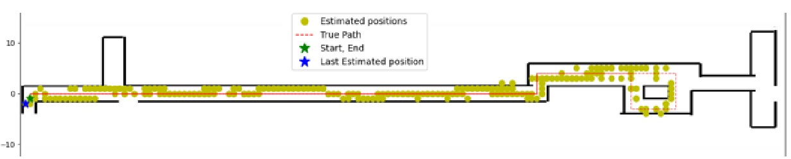

# SC 기반 실내 위치 추정

본 프로젝트는 스마트폰 또는 웨어러블 기기에서 수집한 PDR + RSSI 데이터를 기반으로  
SC(Surface Correlation) 알고리즘을 활용하여 실내 위치를 추정하는 알고리즘입니다.

---

## 📁 폴더 구조

SC_Localization/
├── main.py # 전체 위치 추정 코드
├── requirements.txt # 필요한 라이브러리 목록
├── README.md # 설명 파일
├── images/ # 결과 이미지
│ └── result_example.png
├── data/ # 예시 데이터
│ ├── radiomap_sample.csv
│ └── PDR_sample.csv

---

## 💡 주요 기능

- PDR + RSSI 기반 위치 추정
- URS(사용자 RSSI Surface) 생성
- ±10° 회전 후보 비교를 통한 누적 헤딩 보정
- 라디오맵과의 MAE 기반 상관도 계산
- 실시간 시각화 결과 제공

---

## 🛠️ 실행 방법

1. 의존성 설치

```bash
pip install -r requirements.txt

2. 메인 코드 실행
python main.py


---

## 📊 결과 예시



---

## 📚 데이터 형식

- `radiomap_sample.csv`: `x, y, AP1, AP2, ...`
- `PDR_sample.csv`: `step, time, x, y, RSSI_AP1, RSSI_AP2, ...`

---

## 📩 문의

작성자: 김보성 , 김재위
연락처: [넣으십쇼!]

